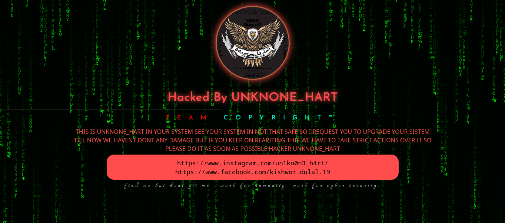

# deface co0de 


# 🚀 Matrix Effect Deface Page

This project is a Matrix-style deface page featuring an animated background with falling letters and a prominent hacked message. The page uses HTML, CSS, and JavaScript to create the visual effect and includes multi-language support for English, Chinese, Urdu, and Nepali characters.

## ✨ Features

- **Matrix Animation**: The background is animated with falling letters, inspired by the iconic Matrix movie effect.
- **Multi-Language Support**: The animation includes characters from English, Chinese, Urdu, and Nepali, with Nepali characters appearing larger.
- **Customizable Message**: The page prominently displays a hacked message with customizable text.
- **Responsive Design**: The layout adjusts to different screen sizes, ensuring a consistent experience across devices.
- **Stylish Design**: The page uses modern fonts and styles for an impactful look.

## 📄 Usage

1. **Clone the Repository**:
    ```bash
    git clone https://github.com/your-username/matrix-effect-deface.git
    cd matrix-effect-deface
    ```

2. **Open the HTML File**:
    Open the `index.html` file in your preferred web browser to see the effect in action.

## 🔧 Customization

- **Background Animation**: The falling letters animation is controlled by the `<canvas>` element and the accompanying JavaScript code. You can modify the letters and their behavior by editing the `letters` array and the `draw` function in the script.
- **Main Image**: Replace the `dp.jpg` file with your own image to change the main logo. Ensure the new image is placed in the same directory as the HTML file.
- **Text Content**: Customize the main hacked message, team name, and additional text by editing the HTML content within the `<div class="mainContainer">` element.

## 📝 Code Breakdown

### HTML

The structure of the page is defined in the `index.html` file. It includes the following main sections:
- **Canvas**: Used for rendering the falling letters animation.
- **Main Container**: Contains the logo, hacked message, and additional text.

### CSS

Styles are defined within a `<style>` block in the HTML file. Key styles include:
- **Body**: Sets the background color and font.
- **Canvas**: Ensures the canvas covers the entire viewport and is positioned behind other content.
- **Main Container**: Styles for the logo, hacked message, and additional text.

### JavaScript

The script controls the falling letters animation:
- **Canvas Initialization**: Sets up the canvas and context for drawing.
- **Letters Setup**: Defines the characters used in the animation, including multi-language support.
- **Draw Function**: Animates the falling letters, with larger font size for Nepali characters.
- **Animation Loop**: Uses `setInterval` to continuously update the animation.

### Adding Multi-Language Characters

To add more characters to the animation, modify the `letters` string in the JavaScript code. The current setup includes:
- English: `ABCDEFGHIJKLMNOPQRSTUVXYZ`
- Chinese: `汉字漢字`
- Urdu: `ءآأؤإئابتثجحخدذرزسشصضطظعغفقكلمنهوىي`
- Nepali: `कखगघङचछजझञटठडढणतथदधनपफबभमयरलवशषसह`

## 🎨 Demo



## 📜 License

This project is licensed under the MIT License. See the [LICENSE](LICENSE) file for details.

## 🙏 Acknowledgements

- Inspired by the Matrix movie's iconic falling letters effect.
- Fonts used: [Josefin Sans](https://fonts.google.com/specimen/Josefin+Sans), [Waterfall](https://fonts.google.com/specimen/Waterfall).

## 🤝 Contributing

Feel free to open issues or submit pull requests if you have suggestions for improvements or find any bugs.

## 📧 Contact

For any questions or inquiries, please contact [kishwordulal44@gmail.com](mailto:kishwordulal44@gmail.com).

---

Enjoy the Matrix Effect Deface Page! Remember to use it responsibly and ethically.
